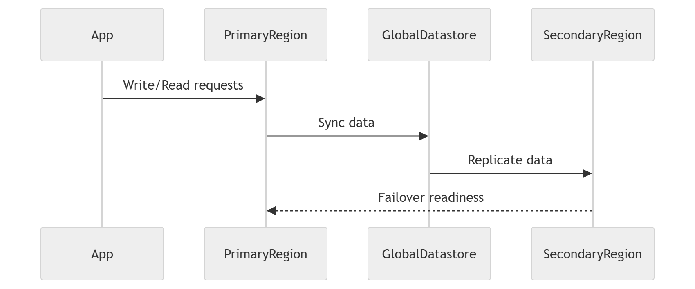

# AWS ElastiCache Global Datastore Terraform Module

A production-ready Terraform module to deploy AWS ElastiCache (Redis) with Global Datastore support, enabling multi-region replication, high availability, monitoring, logging, and secure networking.

# 📦 Features

# 🌍 Global Datastore (Multi-Region Replication)
* AWS ElastiCache Global Datastore for Redis
* Primary region auto-selected from AWS provider config
* Secondary region defined via provider alias (provider.tf)
* Fully managed cross-region replication

# 🧩 Cluster Configuration (Cluster Mode Disabled)
* Default: 1 primary node + 1 read replica
* Fully configurable via:
     * num_cache_clusters

# ⚙️ Fully Configurable Infrastructure

All key parameters are exposed via variables.tf:

 * Engine type (Redis)
 * Engine version
 * Node type
 * Parameter group
 * Port
 * Subnet group IDs
 * Security group IDs
 * Preferred availability zone

# 💾 Backup & Maintenance
 * Snapshot retention: 1 (default, configurable)
 * Snapshot window: 03:00–05:00 UTC
 * Maintenance window: sun:05:00–sun:09:00 UTC

# 🔐 Security
 * In-transit encryption support:
     * transit_encryption_enabled
 * VPC-based deployment with security groups
 * Subnet group isolation

# 📢 Monitoring & Notifications
 * SNS notifications for ElastiCache events
 * Supports operational alerting and incident response workflows

# 📊 Logging & Observability

Supports:
 * Slow logs
 * Engine logs

Configured via:
 * slow_log_configuration
 * engine_log_configuration

Export targets:

 * Amazon S3
 * AWS Kinesis Data Firehose

# 🌐 Architecture Overview
## Multi-Region Global Datastore Setup

# 🏗️ Cluster Architecture (Single Region View)

# 🚀 Usage
## Example Terraform Module

module "elasticache" {
  source = "./modules/elasticache"

  engine               = "redis"
  engine_version       = "7.x"
  node_type            = "cache.t3.medium"
  num_cache_clusters   = 2

  port                 = 6379
  parameter_group_name = "default.redis7"

  subnet_group_ids     = var.subnet_ids
  security_group_ids   = var.security_group_ids

  transit_encryption_enabled = true

  snapshot_retention_limit = 1
  snapshot_window          = "03:00-05:00"
  maintenance_window       = "sun:05:00-sun:09:00"

  slow_log_configuration  = var.slow_log_configuration
  engine_log_configuration = var.engine_log_configuration

  sns_topic_arn = var.sns_topic_arn
}

# 📤 Outputs
Output	                        Description
primary_endpoint	            Primary Redis endpoint
reader_endpoint	                Read replica endpoint
replica_id	                    Replica identifier
replica_arn	                    Replica ARN
engine_version	                Redis engine version
global_replication_group_id	    Global datastore ID

# 🌎 Global Replication Flow

# 🔐 Security Considerations
  * Always enable encryption in transit in production
  * Restrict security groups to application layers only
  * Use private subnets for ElastiCache nodes
  * Enable logging for audit and debugging

# 📊 Observability

This module supports full observability via:
  * AWS SNS alerts
  * Redis engine logs
  * Slow query logs
  * Firehose/S3 integration

# 🧠 Design Principles
  * Infrastructure as Code (IaC)
  * Multi-region resilience
  * Modular and reusable design
  * Secure-by-default configuration
  * Observability-first architecture

# 📌 Requirements
 * Terraform >= 1.3
 * AWS Provider >= 5.x
 * Redis-compatible ElastiCache engine